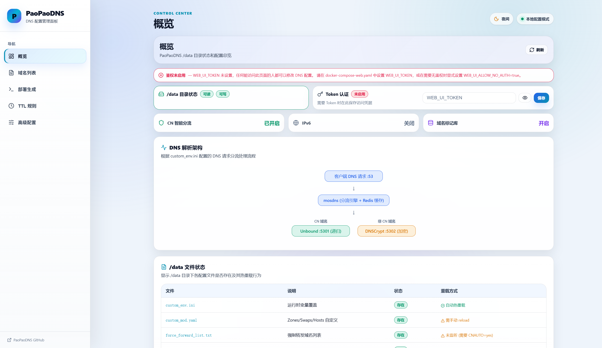
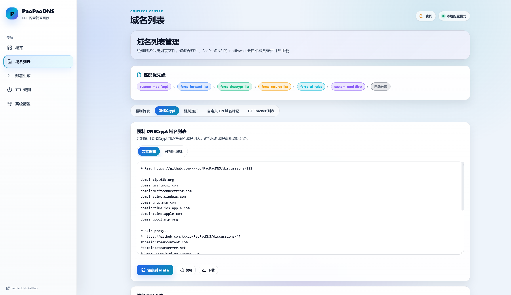
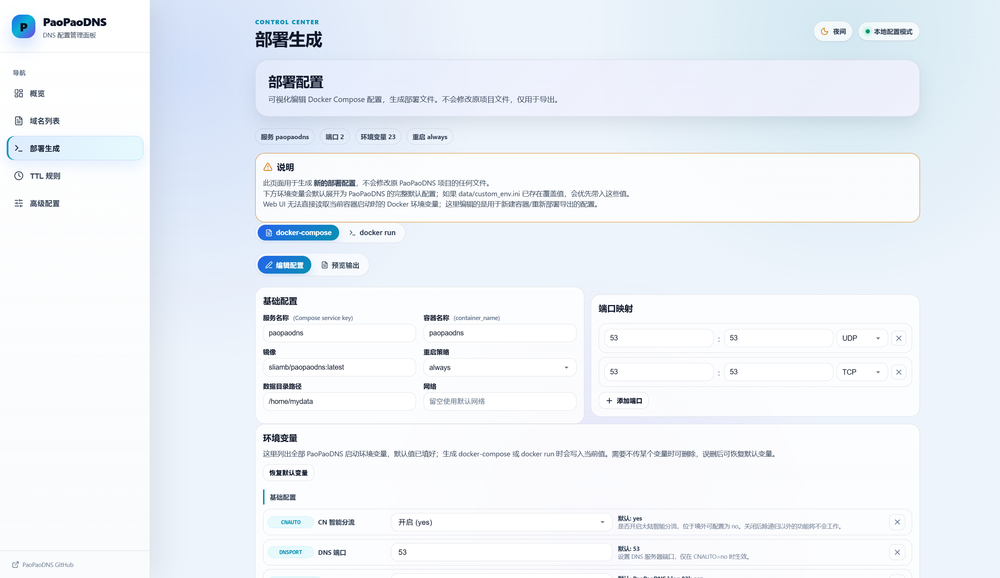
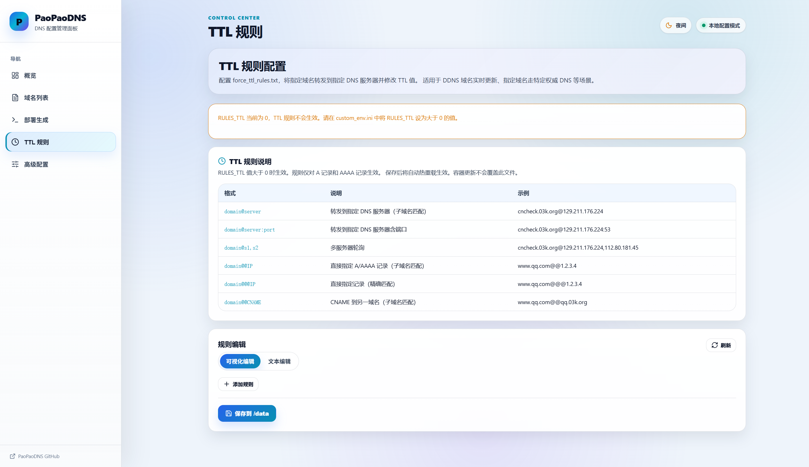
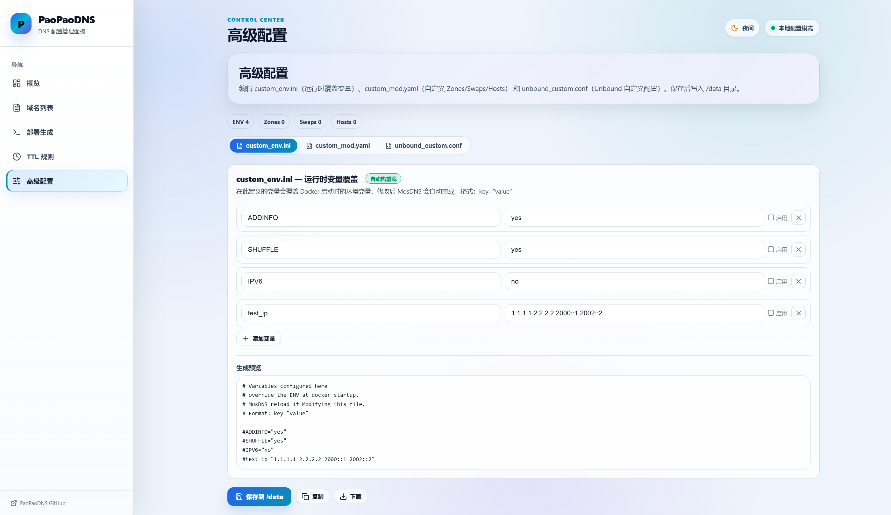

# PaoPaoDNS Web UI

一个给 [PaoPaoDNS](https://github.com/kkkgo/PaoPaoDNS) 使用的 Web 配置面板。

它以 sidecar 容器方式运行，和 PaoPaoDNS 共享同一个 `/data` 目录，用来查看、编辑常用配置文件。Web UI 不挂载 Docker socket，不控制主容器，只负责安全地读写 `/data` 中的配置文件。

> 适合已经在用 PaoPaoDNS，但不想每次都手动编辑 `custom_env.ini`、各种 `force_*_list.txt`、`force_ttl_rules.txt` 的用户。

## 主要功能

- 查看 `/data` 目录状态、认证状态、配置文件是否存在
- 查看文件保存后是否会自动热重载，以及未生效原因
- 编辑 `custom_env.ini`，支持启用/禁用变量
- 编辑域名列表：
  - `force_forward_list.txt`
  - `force_dnscrypt_list.txt`
  - `force_recurse_list.txt`
  - `custom_cn_mark.txt`
  - `trackerslist.txt`（Tracker URL 列表，仅文本编辑）
- 编辑 `force_ttl_rules.txt`，支持 `@`、`@@`、`@@@` 规则
- 编辑 `custom_mod.yaml`、`unbound_custom.conf`
- 生成 docker compose / docker run 部署配置
- 支持亮色/暗色主题

## 界面预览

### 概览

查看 `/data` 目录读写状态、Token 鉴权状态、关键配置文件是否存在，以及各文件保存后的热重载条件。



### 域名列表

支持常用分流列表的文本编辑和可视化编辑，可在列表中插入规则或注释，保存后根据当前运行条件提示是否会自动热重载。



### 部署生成

可视化生成 `docker-compose.yaml` 或 `docker run` 命令，用于新建 PaoPaoDNS 容器或重新部署；此页面只导出配置，不写入 `/data`。



### TTL 规则

可视化编辑 `force_ttl_rules.txt`，适合把指定域名转发到指定 DNS 或直接指定 A/AAAA/CNAME 结果。



### 高级配置

编辑 `custom_env.ini`、`custom_mod.yaml`、`unbound_custom.conf`。页面会根据文件类型提示自动热重载、手动 reload 或重启容器。



## 使用流程

1. 部署 PaoPaoDNS 与 Web UI，并确认两个容器共享同一个 `/data` volume 或 bind mount。
2. 访问 `http://127.0.0.1:8080`，输入 `WEB_UI_TOKEN` 完成鉴权。
3. 在「概览」确认 `/data` 可读写、文件存在状态和热重载条件。
4. 在「域名列表」「TTL 规则」「高级配置」中编辑对应文件并保存。
5. 根据保存后的提示判断配置是否已自动热重载；如果提示需要 reload 或重启，请在宿主机执行对应操作。
6. 如需重新部署，可在「部署生成」中导出 `docker-compose.yaml` 或 `docker run` 命令。

## 设计原则

- **不需要 Docker socket**：Web UI 不能控制宿主机 Docker，也不能随意操作容器。
- **只读写白名单文件**：后端只允许访问 PaoPaoDNS 常用配置文件。
- **共享 `/data` 即可工作**：Web UI 和 PaoPaoDNS 通过同一个 volume 或 bind mount 配合。
- **保存后给出生效提示**：自动热重载、需要 `reload.sh`、需要重启容器都会在页面提示。

## 快速开始

### 方式一：同时部署 PaoPaoDNS + Web UI

适合还没有部署 PaoPaoDNS，或者愿意用本仓库 compose 文件重新部署的用户。

```bash
git clone https://github.com/Lovest20018/PaoPaoDNS-WebUI.git
cd PaoPaoDNS-WebUI

# 生成 Web UI 登录 Token
export WEB_UI_TOKEN=$(openssl rand -hex 32)

# 启动 PaoPaoDNS + Web UI
docker compose -f docker-compose-web.yaml up -d
```

启动后访问：

```text
http://127.0.0.1:8080
```

登录时使用刚才生成的 `WEB_UI_TOKEN`。

默认映射为 `127.0.0.1:8080:8080`。如果宿主机 `8080` 已被占用，只需要改冒号左侧的宿主机端口，例如 `127.0.0.1:8123:8080`；容器内端口 `8080` 保持不变。

`docker-compose-web.yaml` 会创建两个服务：

- `paopaodns`：官方 `sliamb/paopaodns:latest` 镜像
- `paopaodns-web`：GHCR 预构建 Web UI 镜像（默认 `ghcr.io/lovest20018/paopaodns-webui:latest`）

两个容器共享同一个 `paopaodns-data` volume。

### 方式二：给已有 PaoPaoDNS 添加 Web UI

如果你已经有一个运行中的 PaoPaoDNS 容器，只需要让 Web UI 挂载同一个 `/data`。

#### 1. 选择 Web UI 镜像

```bash
git clone https://github.com/Lovest20018/PaoPaoDNS-WebUI.git
cd PaoPaoDNS-WebUI

# 可选：先保存当前 PaoPaoDNS 容器的环境变量，后面按实际值同步到 .env
docker inspect paopaodns --format '{{range .Config.Env}}{{println .}}{{end}}' | sort > paopaodns-old-env.txt
```

创建 `.env`：

```bash
cat > .env <<EOF
WEB_UI_TOKEN=$(openssl rand -hex 32)

# Web UI 镜像；默认使用 GHCR 预构建镜像，不需要本地 build
PAOPAODNS_WEB_IMAGE=ghcr.io/lovest20018/paopaodns-webui:latest

# 建议按 paopaodns-old-env.txt 中的实际值填写，仅用于 Web UI 判断热重载条件
TZ=Asia/Shanghai
CNAUTO=yes
CNFALL=yes
IPV6=no
CN_TRACKER=yes
USE_MARK_DATA=yes
CUSTOM_FORWARD=
RULES_TTL=0
EOF

chmod 600 .env
```

如果你使用下面的 `docker run` 命令，请先把 `.env` 加载到当前 shell：

```bash
set -a
. ./.env
set +a
```

如果使用 `docker compose`，Compose 会自动读取同目录的 `.env`。

如果你要本地开发或 GHCR 镜像还没发布，也可以手动构建：

```bash
docker build -t paopaodns-web ./web
export PAOPAODNS_WEB_IMAGE=paopaodns-web
```

#### 2A. 如果 PaoPaoDNS 使用宿主机目录

假设你的 PaoPaoDNS 数据目录是 `/opt/paopaodns/data`：

```bash
docker run -d \
  --name paopaodns-web \
  --restart unless-stopped \
  -v /opt/paopaodns/data:/data \
  -e DATA_DIR=/data \
  -e WEB_UI_TOKEN="$WEB_UI_TOKEN" \
  -e TZ="${TZ:-Asia/Shanghai}" \
  -e CNAUTO="${CNAUTO:-yes}" \
  -e CNFALL="${CNFALL:-yes}" \
  -e IPV6="${IPV6:-no}" \
  -e CN_TRACKER="${CN_TRACKER:-yes}" \
  -e USE_MARK_DATA="${USE_MARK_DATA:-yes}" \
  -e CUSTOM_FORWARD="${CUSTOM_FORWARD:-}" \
  -e RULES_TTL="${RULES_TTL:-0}" \
  -p 127.0.0.1:8080:8080 \
  "$PAOPAODNS_WEB_IMAGE"
```

#### 2B. 如果 PaoPaoDNS 使用 Docker named volume

先查看 PaoPaoDNS 使用的 volume：

```bash
docker inspect paopaodns --format '{{range .Mounts}}{{.Name}} {{end}}'
```

假设查到的是 `paopaodns-data`：

```bash
docker run -d \
  --name paopaodns-web \
  --restart unless-stopped \
  -v paopaodns-data:/data \
  -e DATA_DIR=/data \
  -e WEB_UI_TOKEN="$WEB_UI_TOKEN" \
  -e TZ="${TZ:-Asia/Shanghai}" \
  -e CNAUTO="${CNAUTO:-yes}" \
  -e CNFALL="${CNFALL:-yes}" \
  -e IPV6="${IPV6:-no}" \
  -e CN_TRACKER="${CN_TRACKER:-yes}" \
  -e USE_MARK_DATA="${USE_MARK_DATA:-yes}" \
  -e CUSTOM_FORWARD="${CUSTOM_FORWARD:-}" \
  -e RULES_TTL="${RULES_TTL:-0}" \
  -p 127.0.0.1:8080:8080 \
  "$PAOPAODNS_WEB_IMAGE"
```

也可以直接参考：

```bash
docker compose -f docker-compose.sidecar.yaml up -d
```

使用前请按你的实际情况修改 `docker-compose.sidecar.yaml` 中的 volume。

## 为什么建议镜像几个 PaoPaoDNS 环境变量？

Web UI 不挂 Docker socket，所以它不能直接读取另一个容器的启动环境变量。

为了让“保存后是否会自动热重载”的提示更准确，建议把这些变量也传给 Web UI 容器：

```yaml
- CNAUTO=yes
- CN_TRACKER=yes
- USE_MARK_DATA=yes
- CUSTOM_FORWARD=
- RULES_TTL=0
```

如果你在 `custom_env.ini` 中配置了同名变量，Web UI 会以 `custom_env.ini` 中启用的值作为运行时覆盖来判断。

## 页面说明

### 概览

查看 `/data` 是否可读写、文件是否存在、各配置文件当前是否满足自动热重载条件。

### 环境变量

只读展示 `custom_env.ini` 中定义的变量覆盖。需要修改时请到“高级配置”。

### 域名列表

适合编辑常用分流列表：

- `domain:example.com`：匹配自身和子域名
- `full:example.com`：完整匹配
- `regexp:`：正则匹配
- `keyword:`：关键字匹配

`trackerslist.txt` 是 Tracker URL 列表，不是域名规则文件，因此页面只提供文本编辑，避免误改格式。

### TTL 规则

支持 PaoPaoDNS 的 TTL 规则语法：

```text
example.com@1.2.3.4:53
example.com@@1.2.3.4
example.com@@@1.2.3.4
example.com@@target.example.net
```

- `@`：转发到指定 DNS 服务器
- `@@`：子域名匹配，直接指定 A/AAAA/CNAME
- `@@@`：精确匹配，直接指定 A/AAAA/CNAME

### 高级配置

- `custom_env.ini`：保存后通常自动热重载
- `custom_mod.yaml`：保存后需要在宿主机执行 `docker exec paopaodns reload.sh` 或重启容器
- `unbound_custom.conf`：保存后需要重启 PaoPaoDNS 容器

## 安全建议

- 一定要设置 `WEB_UI_TOKEN`。
- 默认端口建议绑定到 `127.0.0.1:8080`。
- 如果要通过公网访问，建议放到反向代理后面，并启用 HTTPS。
- 不建议设置 `WEB_UI_ALLOW_NO_AUTH=true`，除非你明确知道风险。

## 常见问题

### 保存后一定立即生效吗？

不一定。不同文件生效方式不同：

| 文件 | 生效方式 |
|---|---|
| `custom_env.ini` | 自动热重载 |
| `force_dnscrypt_list.txt` | 自动热重载 |
| `force_recurse_list.txt` | 自动热重载 |
| `force_forward_list.txt` | 需要 `CNAUTO=yes` 且 `CUSTOM_FORWARD` 有效 |
| `force_ttl_rules.txt` | 需要 `CNAUTO=yes` 且 `RULES_TTL > 0` |
| `custom_cn_mark.txt` | 需要 `CNAUTO=yes` 且 `USE_MARK_DATA=yes` |
| `trackerslist.txt` | 需要 `CNAUTO=yes` 且 `CN_TRACKER=yes` |
| `custom_mod.yaml` | 需要执行 `docker exec paopaodns reload.sh` 或重启容器 |
| `unbound_custom.conf` | 需要重启容器 |

页面保存后会显示当前文件的生效提示。

### Web UI 会不会控制我的 PaoPaoDNS 容器？

不会。Web UI 不挂载 Docker socket，也不安装 Docker CLI。它只读写共享 `/data` 中的配置文件。

### 忘记 Token 怎么办？

重新创建 Web UI 容器，并设置新的 `WEB_UI_TOKEN` 即可。Token 不会写入 `/data`。

### 可以不设置 Token 吗？

可以显式设置：

```yaml
WEB_UI_ALLOW_NO_AUTH=true
```

但不推荐。Web UI 可以修改 DNS 配置，如果暴露到网络，无认证会有明显风险。

## 开发

```bash
cd web
npm install
npm run dev
```

构建：

```bash
npm --prefix web run build
```

后端开发运行：

```bash
cd web/backend
pip install -r requirements.txt
DATA_DIR=/path/to/paopaodns/data WEB_UI_ALLOW_NO_AUTH=true python app.py
```

## 与 PaoPaoDNS 的关系

本项目是 PaoPaoDNS 的非官方 Web 管理面板，核心思路是通过共享 `/data` 文件夹与 PaoPaoDNS 配合。

PaoPaoDNS 原项目地址：<https://github.com/kkkgo/PaoPaoDNS>
